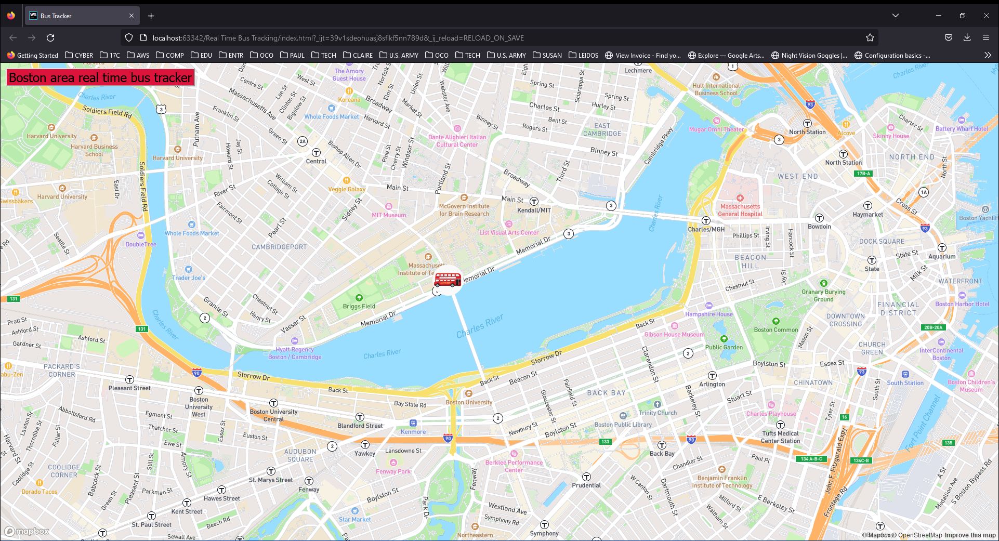

# Real Time Bus Tracker:



## I. Project Description:

This **web application** tracks the **real-time bus location** of one of the bus routes in The Massachusetts Bay Transportation Authority (MBTA) area. The project makes use of the [mapbox API](https://docs.mapbox.com/mapbox-gl-js/api/) to generate the map, and the custom [bus marker](https://docs.mapbox.com/mapbox-gl-js/api/markers/). To get real-time information for the bus locations, the [MBTA V3 API](https://api-v3.mbta.com/) was used. 

This project demonstrates many concepts covered in **asynchronous programming**. Most modern **web pages** relly on hundreds of servers to incorporate data, and these all have to be done **asynchronously**. To get data for the bus locations an ```async function()``` was used to ```await``` for information from the API.

### Modifications:

This is a modification of the "Real Time Bus Tracker" in MIT's coding bootcamp. A couple of improvements I made from the original exercise are the following:
* Real-time data was incorporated for the bus locations. The original exercise used an array of coordinates for the Bus Stops along Massachusetts Ave as points for the Marker to move. I replaced this with the actual latitude and longitude of the Bus, so the Marker moves based on the actual bus location every 10 seconds.
* The map version was changed from the original exercise from one of the map styles found in mapbox.   
* The default Map Marker from mapbox was changed to a custom Bus icon to better reflect the movement of the Marker.
* Some color was added to the background for the button to make it more visible.


## II. How to Run:

The first step would be to fork the repository to your own GitHub account.

The next step would be to **clone the repository** to your local machine by going to the **Project's ReadMe Page** and selecting ```<> Code``` and copy the **project URL**.

Cloning your own repository would depend on your local machine's **Operating System (OS)** whether it be ```Windows```, ```Mac```, or ```Linux```. Some of the steps or commands may vary but there are some similarities. Here is an overall guide based on an article posted in GitHub Docs.

[Cloning a repository](https://docs.github.com/en/repositories/creating-and-managing-repositories/cloning-a-repository?platform=linux)

After **cloning your repository** open the ```mapanimation.js``` file, and add your mapbox public token on line 2 as indicated in the comments.

Navigate to the **directory location** of the files for the project. Look for the ```index.html``` file. Open any web browser such as ```Chrome``` or ```Firefox``` and drag and drop the ```index.html``` file into the browser.

Click on the ```Boston area real time bus tracker``` button at the top left of the page to see the bus tracker move as shown below (screenshot). The information on the right side of the page is the actual coordinates of bus location as it moves along its route printed to the console. This can be referenced when needed and can be easily closed.

The bus movement might be a bit slow since the ```setTimeout()``` function to pull data from MBTA is set to 10 seconds. To make the animation smoother or faster the data can be refreshed on a shorter time interval, but this can risk the user's API Token from being banned from MBTA for flooding it with requests. 

https://user-images.githubusercontent.com/88525094/211162133-50b3322f-005f-48ed-ab89-e32ad1cf1c82.mp4

## III. Roadmap of future improvements:

I would like to add the following features and improvements for the web application to enhance user experience.

* a navbar with drop down menus for options
* make the marker icon rotate to the direction of travel
* menu to switch between different bus icons
* menu to switch between different types of maps
* menu to switch between light and dark mode
* improve starting location of marker
* side-panel that shows the route in text with icons in real-time

## IV. License Information:

The following [document](./LICENSE) shows licensing information from MIT about the free open source code of the program.
